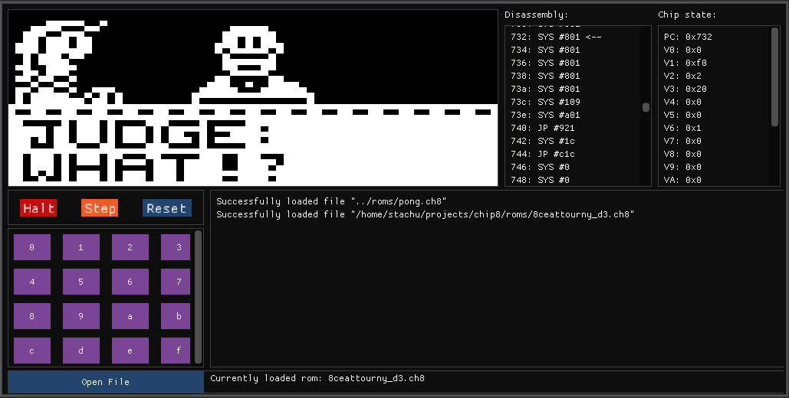

# chip8
A chip8 gaming architecture emulator written in C++.

## Demo

*Note: there are ui issues visible in this screenshot that I've been procrastinating on fixing*

## Features
- Renders CHIP-8 games using OpenGL.
- Displays disassembly of processed instructions along with current chip8 state.
- Allows to run games in instruction-by-instruction manner.
- Controlled by clicking on displayed keypad with 16 keys.
- Can load files passed as program arguments and selected using interactive file dialog.

## Requirements
This repository already contains most of dependecies, either as git submodules, or as regular directories:
- glad
- ImGui
- ImGuiFileDialog
- gtest

It is assumed, that following libraries are already installed on your system:
- glfw3

## Building
1. Install required dependencies. For example, on Fedora Linux you would have to run following command:
```bash
sudo dnf install glfw-devel
```
2. Clone this repository along with dependencies
```bash
git clone --recurse-submodules 'https://github.com/stabor705/chip8' 
```
3. Build the program using cmake
```
cd chip8
mkdir build
cd build
cmake ..
cmake --build .
```

## Docs
You can browse Doxygen generated documentation on
[projects' website](https://stabor705.github.io/chip8)
